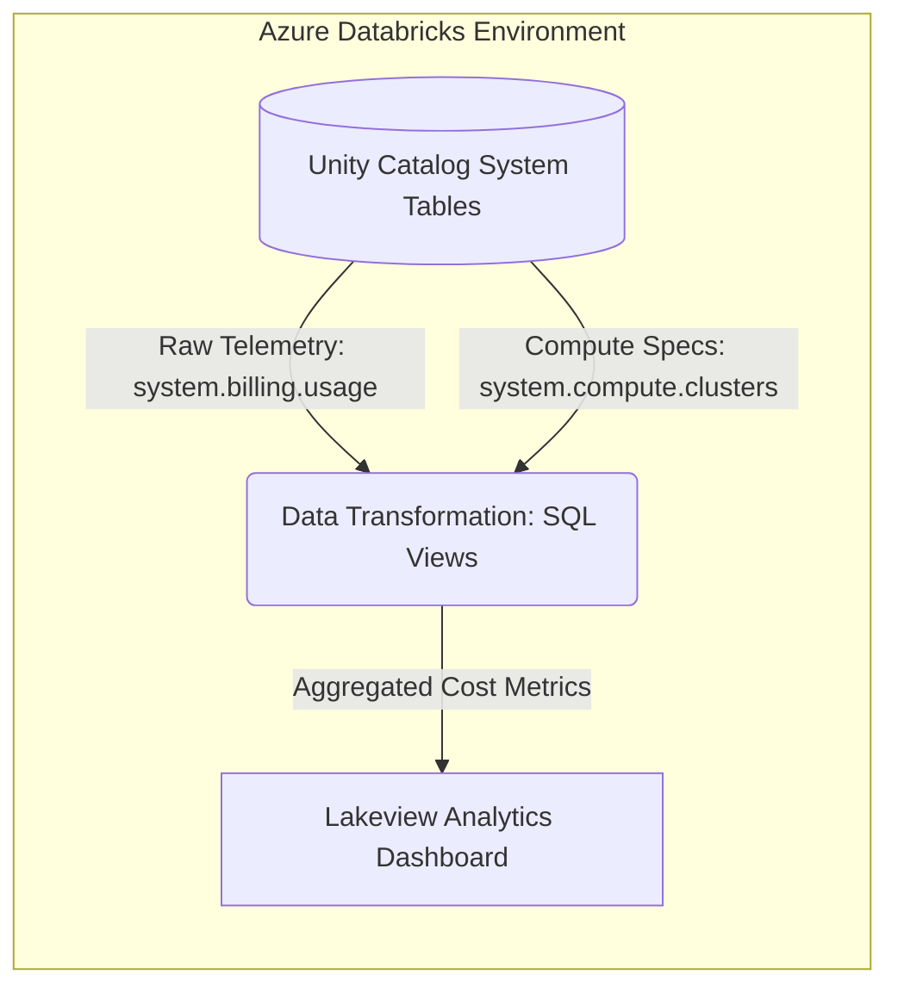

# Databricks Pipelines and Cluster Management Dashboard

## 📌 Overview
This repository contains a FinOps analytics framework designed to monitor, attribute, and optimize cloud compute costs within an Azure Databricks environment. By leveraging Unity Catalog's native system tables (`system.billing.usage`), this project eliminates the need for manual cost tracking and provides an automated, comprehensive view of workspace expenditures.

The focus is on mapping raw compute telemetry to specific users, jobs, and compute types to enable strict cost governance.

## 🏗️ Architecture Concept

## 🎛️ Dashboard Filters
The dashboard features dynamic, interactive filtering to allow granular investigation of costs:
* **Date Range From:** Filters all metrics and charts to a specific temporal window, enabling month-over-month or week-over-week cost comparisons.
* **User:** Isolates compute spend and job execution metrics to specific user email addresses/identities.
* **Job Name:** Drills down into the specific costs and performance metrics associated with individual automated data pipelines.

## 📈 Visualizations & Metrics
The analytics layer provides deep visibility into workspace operations through the following visualizations:

### Key Performance Indicators (KPIs)
* **Total Job Spend (USD):** The aggregate cost of all automated pipeline executions within the selected parameters.
* **Total Cluster Spend (USD):** The aggregate cost of interactive workspace clusters and SQL warehouses.

### Detailed Usage Tables
* **Job Usage Table:** A granular ledger tracking individual `job_name`, executing `Username`, `total_runtime_minutes`, and total `cost_usd`.
* **Cluster Usage Table:** A breakdown of interactive compute resources detailing `cluster_name`, `cluster_owner`, `resource_type`, `total_uptime_hours`, and an optimization `utilization_flag`.

### Cost Distribution & Trends
* **Cost by Compute Type:** A donut chart illustrating the proportional spend between SQL Warehouses and Serverless compute resources.
* **Daily Spend by SKU:** A stacked bar chart providing a day-by-day breakdown of costs categorized by specific Azure Databricks SKUs (e.g., *Premium All-Purpose Serverless Compute*, *Premium Databricks Storage*).
* **Date vs Cost for Each Compute Type:** A time-series line chart tracking expenditure trends across different compute resource types over the selected date range.
* **Spend by Instance Type:** A bar chart identifying which specific hardware configurations are driving the highest costs.

### User & Pipeline Attribution
* **Cost vs Pipeline per User:** Visualizes the cost distribution of various automated jobs assigned to individual users.
* **Cost vs User per Job Pipeline:** A horizontal bar chart detailing exactly which users are triggering the most expensive pipeline runs.

### Operational Efficiency
* **Avg CPU Utilization vs Cost:** Identifies potentially over-provisioned resources by mapping the cost of a compute instance against its actual hardware utilization.
* **Runtime vs Cost:** Correlates pipeline execution duration with its financial cost, highlighting inefficient code that runs too long and burns excess budget.

## 📁 Repository Structure
```text
├── README.md
├── dashboard/
│   ├── dashboard_overview.png
│   └── (additional dashboard snapshots)
└── sql/
    ├── 01_system_billing_extraction.sql
    └── 02_lakeview_dashboard_views.sql
```

## 🛠️ Tech Stack
* **Cloud Platform:** Microsoft Azure
* **Data Processing:** Azure Databricks
* **Governance:** Unity Catalog
* **Query Language:** Databricks SQL
* **Visualization:** Databricks Lakeview Dashboards
